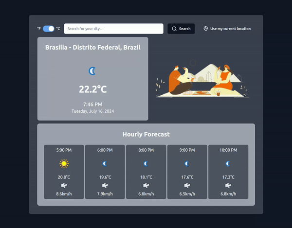

# Cryptocurrency Dashboard



## About
A project that displays the temperature of a specific city using the [weather API](https://www.weatherapi.com/). Despite its simple premise, the project includes some very interesting features, such as the use of [Tailwind CSS](https://tailwindcss.com/) for most of the styling configurations (spacing, colors, fonts), [shadcn/ui](https://ui.shadcn.com/) which provides some ready-made components that can be customized (like buttons, inputs, toasts), and [LottieFiles](https://lottiefiles.com/).

It's worth highlighting LottieFiles here; creating animations with CSS can be quite complex, so this library offers a component that reads a json file and renders the animation. In other words, you just need to go to the LottieFiles animation library, download, and integrate it into your project.

## How to Run Locally
After cloning the project, navigate to the project directory and install the project dependencies using your package manager.

|||
|---|---|
| pnpm | `pnpm install`|
| yarn | `yarn install`|
| npm | `npm install`|


Create an environment variables file named .env.local and add the following environment variables:
```
VITE_API_KEY=
VITE_API_URL=http://api.weatherapi.com/v1/
```
> You need to create an API key on the [weather API](https://www.weatherapi.com/).

With the environment variables set and the packages installed, simply run the following command:
|||
|---|---|
| pnpm | `pnpm dev`|
| yarn | `yarn dev`|
| npm | `npm run dev`|